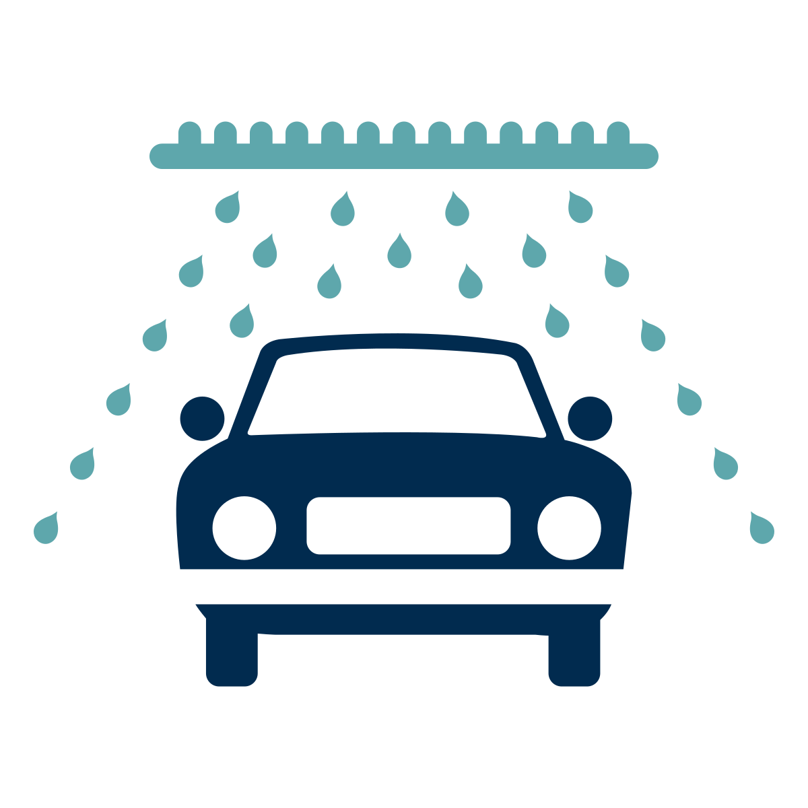

<div align="center">
<p align="center">
  
</p>

<!-- Badges -->

<div align="center">


</div>

<!-- Menu -->

<div align="center">
  <a href="#dart-about">:dart:&nbsp;&nbsp;About</a> &nbsp; | &nbsp;
  <a href="#rocket-technologies">:rocket:&nbsp;&nbsp;Technologies</a> &nbsp; | &nbsp;
  <a href="#white_check_mark-requirements">:white_check_mark:&nbsp;&nbsp;Requeriments</a> &nbsp; | &nbsp;
  <a href="#checkered_flag-starting">:checkered_flag:&nbsp;&nbsp;Starting</a>
</div>

</div>

<!-- About -->

## :dart: About

Projeto consiste em um aplicativo desktop de para gerenciar carros que estão guardado no estacionamento de um lava-jato

**Projeto desenvolvido enquanto Docente na UC10 no SENAC ARARAQUARA!**

<!-- Technologies -->

## :rocket: Technologies

- [Electron](https://www.electronjs.org/)
- [Electron Forge](https://www.electronforge.io/)

<!-- How to use -->

## :checkered_flag: Starting

```bash
# Clone this project
$ git clone git@github.com:KaiqueCovo/dashgo.git

# Go into the repository
$ cd lava-jato

# Install dependencies
$ npm install

# Run make
$ npm run make

# Run the application
$ npm run start
```

---

Made with ♥ by [Kaique Covo](www.linkedin.com/in/kaiquecovo) :wave:
